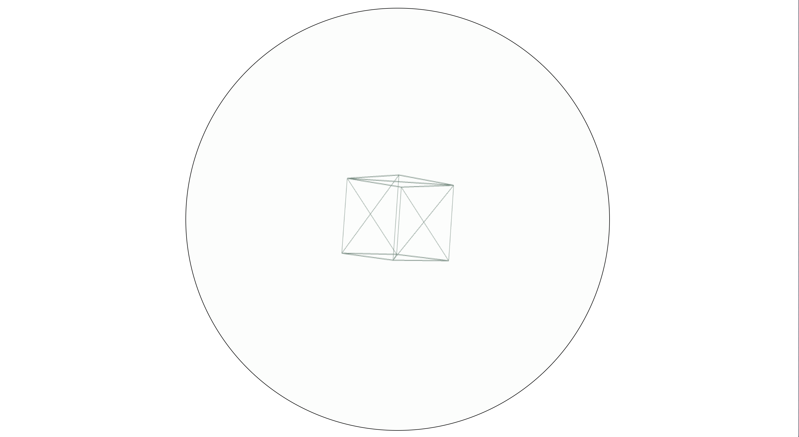
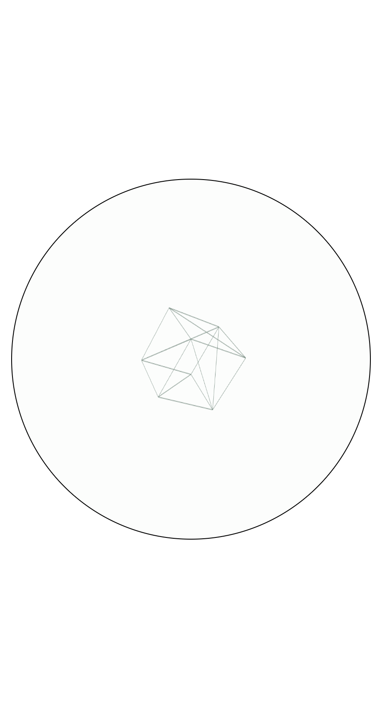

# Relative Responsive canvas Three.js

This is an example of how canvas can be relative responsively resizing while keeping aspect ratio.

[live demo](https://mauromontan.github.io/responsive-canvas) 

> [!NOTE]  
> Device pixel ratio is not workin on gh deployment. :(

## Screenshots

